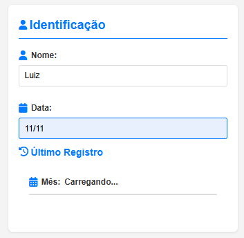

# Roadmap de Evolução do Módulo Produção - Sistema de Gestão

Este documento define o planejamento de evolução do módulo de produção do Sistema de Gestão, organizando as etapas de refatoração e novas funcionalidades para manter o sistema organizado, testável e expansível.

## Padrão de Comportamento

- Cada etapa deve ser realizada de forma incremental, com commit ao final.
- O roadmap deve ser atualizado após cada iteração concluída.
- Cada branch dedicado deve ser rastreável e utilizado apenas para o escopo definido.
- Sempre documentar código com JSDoc padronizado nos arquivos e funções exportadas.
- O processo deve ter histórico de commits claros, descritivos e rastreáveis.
- Manter controller apenas com validação, chamada de serviço e resposta.
- Separar claramente responsabilidades entre frontend e backend.

## Fase 1: Refatoração do Módulo Frontend (registrar-funcao.js)

### Diagnóstico
- O arquivo `registrar-funcao.js` estava grande, com múltiplas responsabilidades misturadas.
- Funções de calendário duplicadas em relação a outros arquivos.
- Lógica de funções/máquinas que poderia ser reaproveitada.
- Falta de separação clara entre UI e regras de negócio.

### Plano de Ação
1. **Módulo de Calendário**
   - [x] Identificar e centralizar funções duplicadas no `calendario.js`
   - [x] Adaptar chamadas para utilizar módulo centralizado

2. **Módulo de Funções e Máquinas**
   - [x] Extrair funções para `funcoes-maquinas.js`
   - [x] Adaptar chamadas para utilizar novo módulo

3. **Foco em Interface**
   - [x] Manter arquivo principal apenas com UI e integração
   - [x] Delegar toda lógica de negócio aos módulos externos

4. **Documentação e Testes**
   - [x] Padronizar JSDoc em todos os arquivos
   - [x] Garantir testes automatizados com Jest

5. **Validação Final**
   - [x] Validar comportamento idêntico após refatoração

6. **Diagnosticar e corrigir erros em produção**

   - [x] Calendário não esta carregando

   

   - [x] DropDown de função não esta carregando 
   
   - [x] DropDown de Maquina não esta carregando 

   - [x] Botão "Adicionar função esta sem resposta" 

   - [x] Botão Submit não responde

   - *Info Console:*
      registrar-funcao.js:254 Uncaught SyntaxError: Identifier 'carregarRegistrosCalendario' has already been declared (at registrar-funcao.js:254:1)

   - *OBS:* Provavelmente sera necessário alterações no front-end para que agora seja servido pelas funções refatoradas

### Observações
- Branch dedicado: `refactor-registrar-funcao`
- Organização modular seguindo separação de responsabilidades
- Garantir validação de regras críticas também no backend

## Fase 2: Refatoração do Controller de Produção e Serviços

### Diagnóstico
- Controller com múltiplas responsabilidades misturadas
- Falta de separação entre regras de negócio e controle
- Lógica de ficha, registros, lotes e funcionários misturadas
- Testes inadequados e baixa cobertura
- Falta de documentação padronizada

### Plano de Ação
1. **Extração de Serviços**
   - [x] Criar `fichaFuncionarioService.js` para lógica de ficha
   - [x] Criar `registroService.js` para operações de registro
   - [x] Criar `funcionarioService.js` para lógica de funcionários
   - [x] Criar `loteService.js` para gerenciamento de lotes

2. **Documentação e Padronização**
   - [x] Documentar todos os serviços e controllers com JSDoc
   - [x] Revisar e documentar endpoints REST e contratos

3. **Testes e Validação**
   - [x] Criar testes automatizados para os serviços
   - [x] Remover testes antigos incompatíveis
   - [x] Expandir cobertura de testes para novos serviços
   - [ ] Integrar testes de API após ajustes no frontend

4. **Integração com Frontend**
   - [x] Iniciar reconstrução da página ficha-funcionário
   - [ ] Finalizar integração completa com os novos serviços

### Observações
- Manter controllers enxutos e serviços bem documentados
- Garantir cobertura adequada de testes para todos os serviços
- Atualizar documentação para facilitar futuras expansões

## Fase 3: Reconstrução da Página Ficha-Funcionário

### Diagnóstico
- Interface atual com problemas de usabilidade e visualização
- Dificuldade na navegação entre dados
- Falta de funcionalidades comparativas
- Falhas no cálculo e exibição de estatísticas

### Plano de Ação
1. **Análise e Design**
   - [ ] Mapear problemas e limitações da página atual
   - [ ] Criar wireframes da nova interface
   - [ ] Definir componentes e visualizações

2. **Componentes Essenciais**
   - [ ] Aprimorar calendário com visualização mensal detalhada
   - [ ] Redesenhar seção de resumo com métricas principais
   - [ ] Implementar tabela detalhada por dia e função

3. **Backend de Suporte**
   - [ ] Desenvolver endpoints para comparação de períodos
   - [ ] Adicionar cálculos precisos para médias e totalizadores
   - [ ] Implementar serviço de metas por funcionário

4. **Frontend Integrado**
   - [ ] Construir HTML modular e responsivo
   - [ ] Implementar visualizações gráficas e comparativas
   - [ ] Adicionar filtros e controles intuitivos
   - [ ] Construir funcionalidades de exportação e análise

### Observações
- Manter foco na experiência do usuário e desempenho
- Garantir acessibilidade e responsividade
- Adicionar feedback visual para ações e processamento

## Fase 4: Documentação e Apresentação do Sistema

### Diagnóstico
- Falta de documentação técnica atualizada
- Ausência de material para apresentação e treinamento
- Necessidade de guias para futuras modificações

### Plano de Ação
1. **Documentação Técnica**
   - [ ] Atualizar diagrama da arquitetura
   - [ ] Documentar todos os endpoints
   - [ ] Criar manual da estrutura de dados e cálculos

2. **Material de Apresentação**
   - [ ] Preparar screenshots e fluxogramas
   - [ ] Criar demonstração com exemplos práticos
   - [ ] Desenvolver guias para novos desenvolvedores

### Observações
- Documentação deve ser clara e atualizada regularmente
- Manter exemplos práticos para facilitar compreensão
- Incluir guias de troubleshooting para problemas comuns

## Fase 5: Expansão Futura

### Plano de Ação
1. **Módulo de Gerenciamento de Lotes**
   - [ ] Redesenhar interface e fluxo de lotes
   - [ ] Implementar backend dedicado

2. **Módulo de Gerenciamento de Funcionários**
   - [ ] Desenvolver cadastro completo de funcionários
   - [ ] Implementar sistema de metas e desempenho
   - [ ] Criar visualizações comparativas

### Observações
- Priorizar módulos conforme necessidades do negócio
- Manter compatibilidade com sistema existente
- Seguir os mesmos padrões de qualidade e testes
