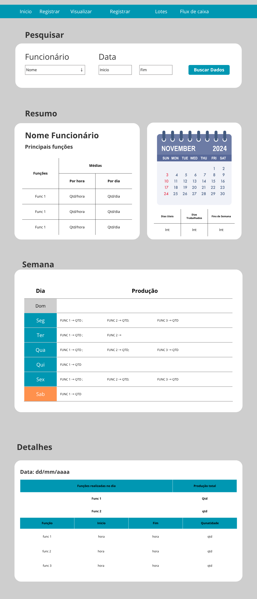

# **Reconstrução Ficha-Funcionário**

## Diagnóstico
- Interface atual com problemas de usabilidade e visualização
- Dificuldade na navegação entre dados
- Falta de funcionalidades comparativas
- Falhas no cálculo e exibição de estatísticas

## **Wireframe**

*Proposta de redesenho da interface da Ficha de Funcionário*

### **Seções**

- Menu de navegação  
        
    Botões para navegação entre paginas
- Pesquisar

    Datalist com o nome dos funcionários
    Entrada de inicio e fim do periodo de pesquisa
    Botão pesquisar
- Resumo
    
    Tabela com a moda das 3 principais funções executadas pelo funcionário 
    Produção média por dia e por hora
    - Calendário
        
        Dias do mes
        Qtd de dias uteis
        Qtd de dias trabalhados
        Fim de semana trabalhados
- Semana
    
    Tabela com os dias da semana atual.
    Coluna produção: Moda das 3 principais funções feitas no dia e com a sua respectiva quantidade
    
- Detalhes

## **Plano de Ação**

### 1. Estrutura e Navegação
- [x] Criar/ajustar menu de navegação entre páginas
- [x] Commit: feat(ficha-func): estrutura inicial e navegação

### 2. Pesquisa e Filtros
- [ ] Implementar datalist/autocomplete para seleção de funcionário
- [ ] Adicionar campos de data início e fim
- [ ] Botão de busca de dados
- [ ] Commit: feat(ficha-func): pesquisa e filtros

### 3. Resumo do Funcionário
- [ ] Exibir moda das 3 principais funções executadas
- [ ] Mostrar produção média por dia
- [ ] Mostrar produção média por hora
- [ ] Exibir total de dias úteis, dias trabalhados e finais de semana trabalhados
- [ ] Commit: feat(ficha-func): resumo do funcionário

### 4. Calendário de Registros
- [ ] Exibir calendário mensal (como já existia)
- [ ] Destacar dias com registro, dias úteis, finais de semana
- [ ] Permitir navegação entre meses/anos
- [ ] Commit: feat(ficha-func): calendário de registros

### 5. Tabela da Semana
- [ ] Exibir tabela com dias da semana atual
- [ ] Coluna de produção: moda das 3 funções do dia e quantidade
- [ ] Commit: feat(ficha-func): tabela da semana

### 6. Detalhes por Dia
- [ ] Exibir tabela detalhada por dia (função, início, fim, quantidade)
- [ ] Permitir expandir/colapsar detalhes por data
- [ ] Commit: feat(ficha-func): detalhes por dia

### 7. Feedback Visual e Usabilidade
- [ ] Adicionar mensagens de erro, loaders e feedbacks visuais
- [ ] Garantir acessibilidade (teclado, leitores de tela)
- [ ] Commit: feat(ficha-func): feedback visual e acessibilidade

### 8. Exportação e Análise
- [ ] Adicionar botão para exportar dados (CSV/Excel)
- [ ] Permitir análise comparativa entre períodos
- [ ] Commit: feat(ficha-func): exportação e análise

### 9. Testes e Validação
- [ ] Testar todos os fluxos e validar dados exibidos
- [ ] Corrigir bugs encontrados
- [ ] Commit: test(ficha-func): testes e validações

### 10. Documentação
- [ ] Atualizar prints e documentação da interface
- [ ] Documentar funções JS com JSDoc
- [ ] Commit: docs(ficha-func): documentação atualizada

## **Observações**
- Manter esforços para construção da pagina em etapas bem claras e definidas
- Criar commits diretos e claros